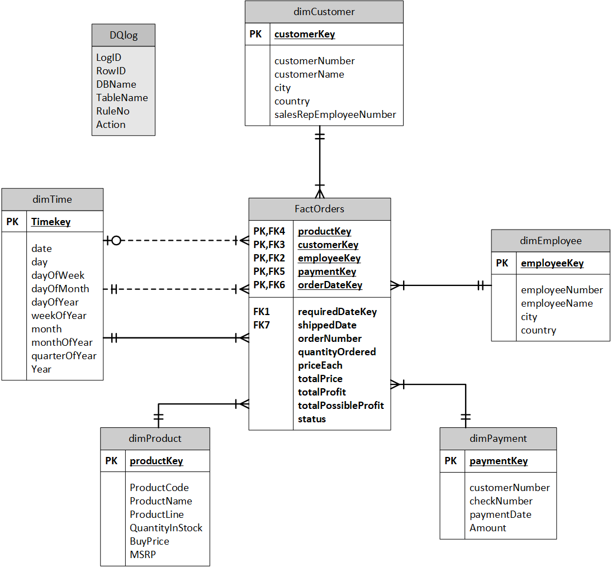

# Sales Analytics Data Warehouse

A data warehouse project designed to support business intelligence and OLAP reporting for a fictional sales company.  
The solution integrates multiple OLTP sources into a **Star Schema** structure, ensuring data accuracy, scalability, and faster analytics.

---

## Star Schema Design

The data warehouse follows a **Star Schema** model with one fact table (`FactOrders`) and multiple dimension tables (`dimCustomer`, `dimEmployee`, `dimProduct`, `dimTime`, and `dimPayment`).

Each dimension table stores descriptive attributes, while the fact table captures measurable business metrics such as quantity ordered, total profit, and total sales.  
A `DQLog` table is included to record data quality validation results.

### Entity Relationship Diagram (ERD)

**Key Highlights**
- Central **FactOrders** table contains primary business metrics.  
- Dimensions link via surrogate keys (`customerKey`, `productKey`, `timeKey`).  
- `dimTime` supports multi-level time analysis (day, month, quarter, year).  
- `DQLog` table ensures data validation and error traceability.  

---

## Data Dictionary

The following table summarizes the key tables and attributes used in the data warehouse, designed according to the **Star Schema** model.  
It includes primary and foreign key relationships to ensure referential integrity between dimensions and fact tables.

| Table | Key Fields | Description |
|-------|-------------|-------------|
| **dimCustomer** | `customerKey (PK)`, `customerNumber`, `customerName`, `city`, `country` | Stores customer details linked to sales transactions. |
| **dimEmployee** | `employeeKey (PK)`, `employeeNumber`, `employeeName`, `city`, `country` | Contains employee and sales representative information. |
| **dimProduct** | `productKey (PK)`, `productCode`, `productName`, `productLine`, `buyPrice`, `MSRP` | Defines product information and pricing attributes. |
| **dimPayment** | `paymentKey (PK)`, `customerNumber`, `checkNumber`, `paymentDate`, `amount` | Stores customer payment records and related attributes. |
| **dimTime** | `timeKey (PK)`, `Date`, `Month`, `QuarterOfYear`, `Year` | Provides time-based dimensions for analytical grouping. |
| **factOrders** | FKs to all dimensions | Central fact table capturing measurable metrics like quantity ordered, total price, and total profit. |

*Source: Data Dictionary – saleAU_NZ OLTP database*

---

## Data Quality and Validation

Data quality rules were applied during the ETL process to ensure data completeness, consistency, and accuracy.  
The following table summarizes the logged records captured in the `DQLog` table after validation.

| Table | DQ Rule(s) Applied | Action Taken | Logged Records |
|--------|--------------------|---------------|----------------|
| **Customer** | Rules 7, 9 | Fix | 5 rejected, 9 fixed |
| **Payment** | Rules 9, 10, 23 | Fix | 9 rejected, 23 fixed |
| **Product** | Rules 1, 4 | Fix | 1 rejected, 1 fixed |
| **OrderDetail** | Rules 2, 3, 6 | Reject | 2–3 rejected |
| **Office** | Rules 5, 4 | Fix | 5 allowed, 4 fixed |
| **ProductOrder** | Rule 8 | Fix | 4 fixed |

These rules helped validate referential integrity, detect duplicates, and identify missing or invalid values before loading data into the warehouse.  
*Source: Data Quality Actions Summary Table – saleAU_NZ*

---

## Technologies Used

- **Database & Tools:** Microsoft SQL Server, SQL Server Management Studio (SSMS)  
- **ETL Process:** SQL scripts for Extract, Transform, and Load operations  
- **Data Modeling:** Star Schema (Fact & Dimension tables)  
- **Data Quality:** Validation via SQL rules and DQLog tracking  

---

## Key Outcomes

- Designed and implemented a **data warehouse** integrating multiple OLTP sources for analytical reporting.  
- Built **ETL pipelines** to extract, transform, and load data with data quality checks.  
- Developed **analytical SQL queries** to evaluate sales, profitability, and employee performance.  
- Improved **data accessibility** for decision-making through structured and validated warehouse design.  

